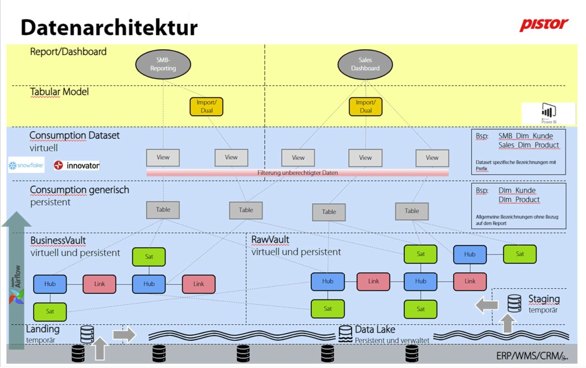

# Pistor Datenarchitektur (firmweite Referenz)

Dies ist das **firmweit gültige** Schichtenmodell für alle DWH-/BIDA-Projekte — identisch über
Projekte hinweg. Es beschreibt *wie* Daten bei Pistor fließen und benannt werden.

> Abgrenzung: Diese Datei ist **firmweit** (in jedem Projekt gleich). Was *ein konkretes* Projekt
> innerhalb dieses Modells tut (welche Hubs/Links/Sats, welche Views, welche Pipeline), gehört in
> [`architecture.md`](architecture.md) — das ist die projektspezifische Datei.

## Diagramm

> Der Text unten beschreibt das Modell vollständig, auch ohne Bild.

## Schichten (von unten nach oben)

Grundlage: **Data Vault 2.0**. Orchestrierung über **Airflow**; Plattform **Snowflake**
(+ *innovator* für die Vault-Automatisierung), Konsum über **Power BI**.

| Schicht | Persistenz | Zweck |
|---|---|---|
| **Quellsysteme** | — | ERP / WMS / CRM / … |
| **Landing** | temporär | Rohdaten-Anlieferung |
| **Data Lake** | persistent, verwaltet | historisierte Rohdaten |
| **Staging** | temporär | Aufbereitung vor dem Vault |
| **Raw Vault** | virtuell und persistent | Hub / Link / Satellite — Rohdaten im Vault-Modell |
| **Business Vault** | virtuell und persistent | Hub / Link / Satellite — Geschäftslogik/-regeln |
| **Consumption generisch** | **persistent** (Tables) | wiederverwendbare Dimensionen/Fakten, **allgemeine** Bezeichnungen ohne Report-Bezug |
| **Consumption Dataset** | **virtuell** (Views) | report-spezifische Sicht, **Filterung unberechtigter Daten** |
| **Tabular Model** | Import/Dual | Power-BI-Modell |
| **Report/Dashboard** | — | z. B. SMB-Reporting, Sales Dashboard |

## Namenskonventionen der Consumption-Schichten

- **Consumption generisch** — allgemeine Bezeichnungen ohne Report-Bezug.
  Beispiel: `Dim_Kunde`, `Dim_Product`.
- **Consumption Dataset** — dataset-spezifische Bezeichnungen mit **Prefix** je Report/Bereich.
  Beispiel: `SMB_Dim_Kunde`, `Sales_Dim_Product`.

> **⚠️ Entwurf — in Phase B zu bestätigen (dbt-Werkstatt, [Review-Arbeitsblatt 3a](rollout/review-arbeitsblatt.md)):**
> Die genauen Namensregeln — insbesondere wie sich der Prefix-Layer zu den dbt-Modellnamen
> (`stg_<source>__<entity>`, `mart_<bereich>__<thema>`, Spalten UPPER_SNAKE_CASE aus
> [`.claude/rules/dbt-snowflake.md`](../.claude/rules/dbt-snowflake.md)) verhält — sind noch nicht
> verbindlich festgelegt. Die obigen Beispiele stammen aus dem Diagramm und dienen als Ausgangspunkt,
> nicht als finaler Standard.

## Prinzipien, die daraus für die Modellierung folgen

- Transformationen in der Schicht bauen, in die sie gehören; keine Schichten mit Ad-hoc-DDL überspringen.
- Persistent vs. virtuell bewusst je Schicht (Consumption generisch = Tables, Dataset = Views).
- Berechtigungsfilterung passiert in der Dataset-Schicht (unberechtigte Daten werden dort ausgefiltert).
